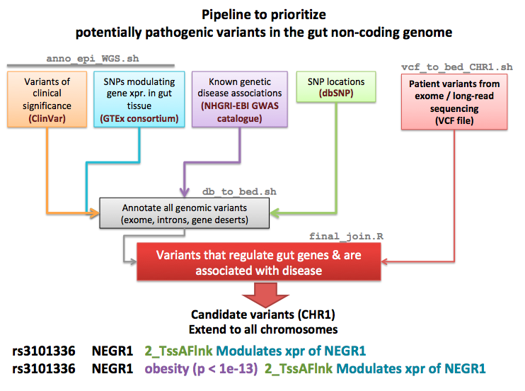

# Toronto Hacktors B

# Summary
50% of genetic associations are located outside gene bodies; this fraction goes up to 80% if you include intronic regions. Therefore we hypothesized that genetic variants responsible for John’s ailments may be located in the noncoding genome. 

**Our goal is to create a pipeline to prioritize variants by combining different sources of variant annotations.**
We hypothesised that causal variants in non-coding genome would be more challenging to analyze, so our emphasis has been on developing a tool focusing on non-coding variants. One of the greatest challenges for analyzing non-coding variants lies in efficient integration of various sources of information, most of which have been generated by various organizations with different goals and tools. Our tool will allow users to capture all these information and analyze variants simply providing a VCF file. 

**Watch this video for a summary of our project:**
**[Video](https://drive.google.com/open?id=1wBYi-VnvkTh-T91QKmmV9yML0a_3mwZM)**

