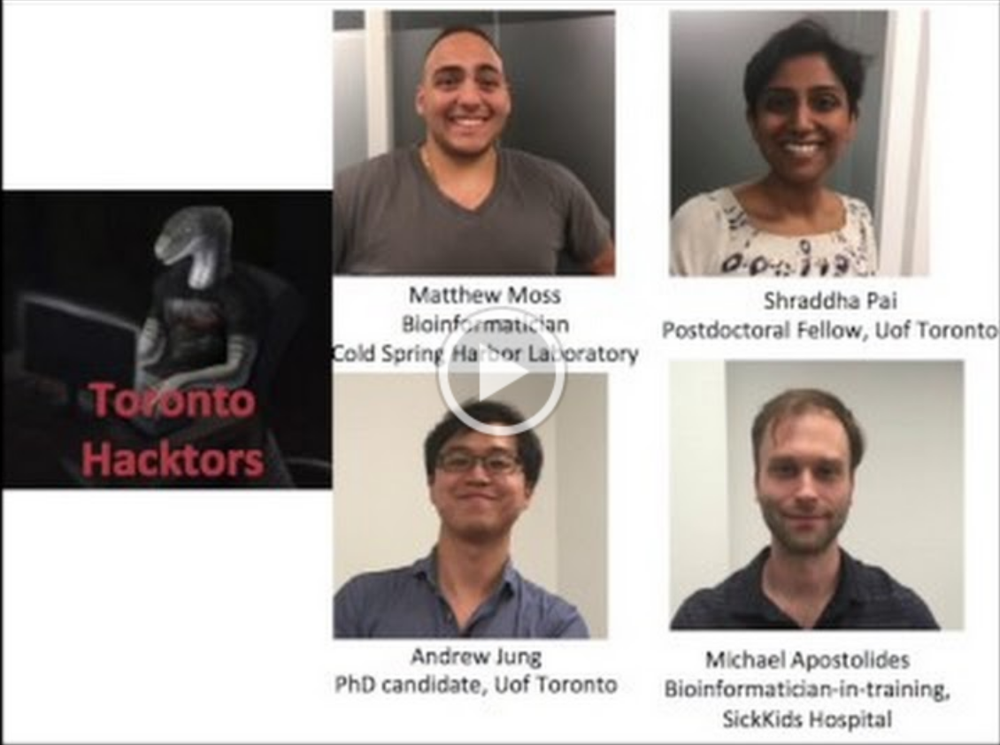

# Toronto Hacktors 🇨🇦 #

Please note: The content in this submission is for informational purposes only, does not constitute providing any medical advice, and is not intended to be a substitute for professional medical advice, diagnosis, or treatment. Always seek the advice of your physician or other qualified health provider with any questions you may have regarding a medical condition. Never disregard professional medical advice or delay in seeking it because of something you have read here.

Members: Michael Apostolides, Orion Buske, Andrew Jung, Mariel Marshall, Matthew Moss, Shraddha Pai, Magda Price

We divided our efforts into two areas, which worked closely together and provided separate writeups and video summaries:

| Clinical | Genomics |
| :---: | :---: |
|  |  |
| [Read more...](clinical/) | [Read more...](genomics/) |

