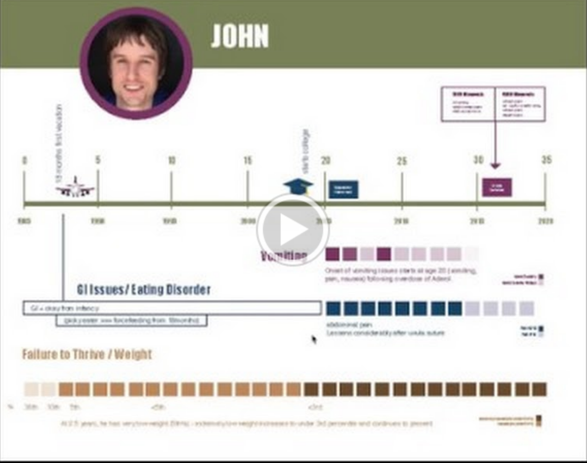
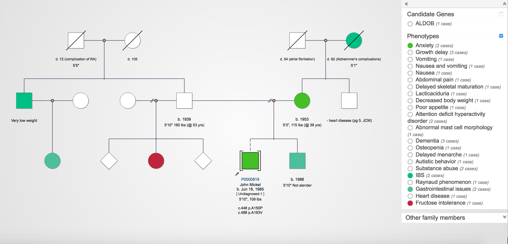
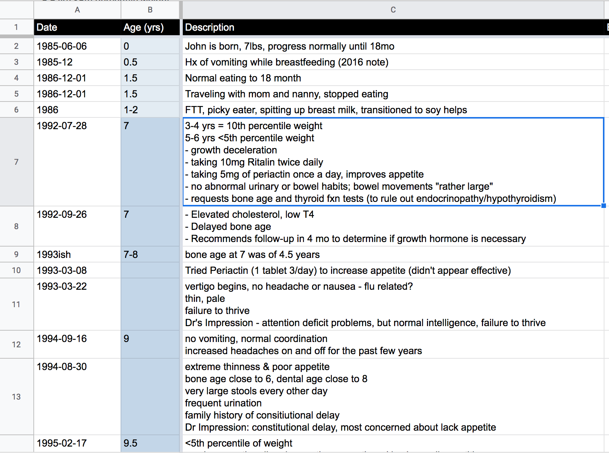
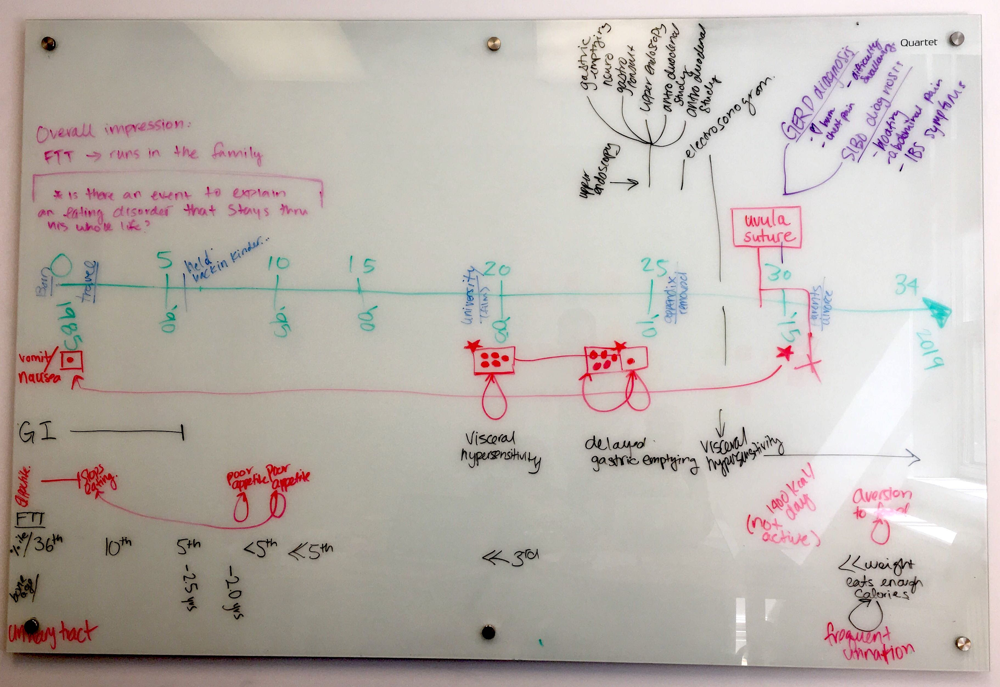
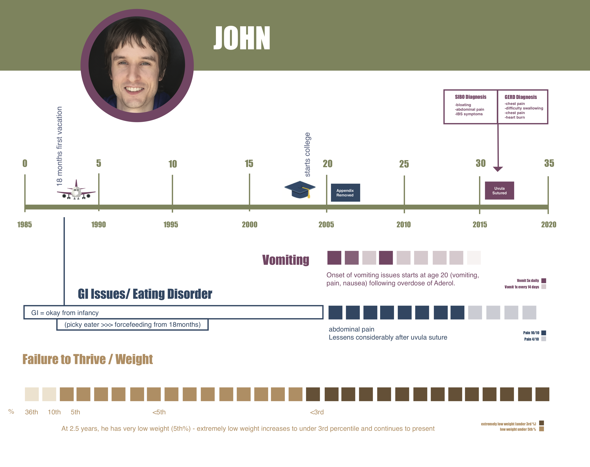

# Toronto Hacktors (Clinical)

Members: Orion Buske, Mariel Marshall, Magda Price

## Video submission

## Introduction

Patients with life-long health problems can have extremely complex medical history that includes multiple visits to family practitioners, referrals to specialists, laboratory tests and interventions. This care pathway is further complicated by life events (e.g., moving, family loss) and environmental exposures (e.g., pathogens, substance abuse) that may complicate symptoms and impact continuity of care.

## Purpose

Create a visual tool to aid health care practitioners to quickly view a patient’s medical history. This will help tease apart constitutional issues from sequelae and environmental factors which allows the health care practitioner to focus testing resources and direct their interaction with the patient (especially important for suspected genetic)

## Approach

### A - Visual family history

* Step 1 - Manually review medical records, extract family symptoms
* Step 2 - Record family symptoms on pedigree (Figure 1)

### B - Visual medical history

* Step 1 - Manually review medical records, record notable events (Figure 2)
    * Order events chronologically
    * Categorize by event type (life event, symptom, clinical finding, laboratory test, intervention)
    * Record relational characteristics (e.g. what was the result of the lab? Did the intervention change the symptom, what was the severity & frequency of the symptom?)
* Step 2 - Visualize the events & relationships (Figures 3 and 4)
    * Created a visual representation of the events and relationships
    * Look for patterns (e.g., symptom progression, co-occurrence of symptoms, life events, interventions, etc.)
    * Design follow up questions where there are gaps in the data
* Step 3 - Interview the patient to fill in gaps

## Results & discussion

After evaluating the patient’s clinical trajectory, we identified that there was considerable phenotypic overlap with HFI. Several reports note compound heterozygous variants in trans in ALDOB - the gene associated with HFI. One is a known pathogenic variant (c.488 C>T) the other is a VUS (c.448 G>C). John’s paternal half-sister was diagnosed with hereditary fructose intolerance (suspect that she shares the c.488 C>T pathogenic ALDOB variant with John). So even if the c.448 G>C is benign, John likely experiences a milder form of HFI (reported in OMIM for individuals with het pathogenic variants in ALDOB). But this left a number of questions as to why it remained undiagnosed after the UCSF dietary intervention. Using Occam’s razor as our guiding principle, we looked for the simplest solution - that he has co-occurring common GI issues that would remain even when fructose is eliminated from his diet: 1) IBS/GI issues (noted in several of his family members) and 2) lactose intolerance (John appears to be homozygous reference for the rs4988235 SNV associated with lactose intolerance in many Europeans).

We suggest the following follow up to confirm these results:
1. ALDOB follow up -
    1. Do John and his half sister share the c.488 C>T pathogenic variant in ALDOB?
    1. We suspect that John’s brother would not be a carrier of this variant
1. Enzymatic assays to test the function of ALDOB
    1. Dietary changes that would address both lactose and fructose intolerance

**Figure 1.** Pedigree drawn from information in the medical records, and then augmented with information from the patient interview.

**Figure 2.** Screenshot of the spreadsheet of key events and information extracted from the medical records, ordered chronologically.

**Figure 3.** Photo of a whiteboard drawing of the key events and medical trajectory.

**Figure 4.** One-page illustration of the patient's medical trajectory.

