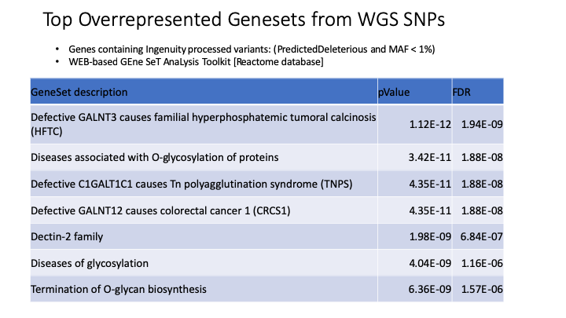
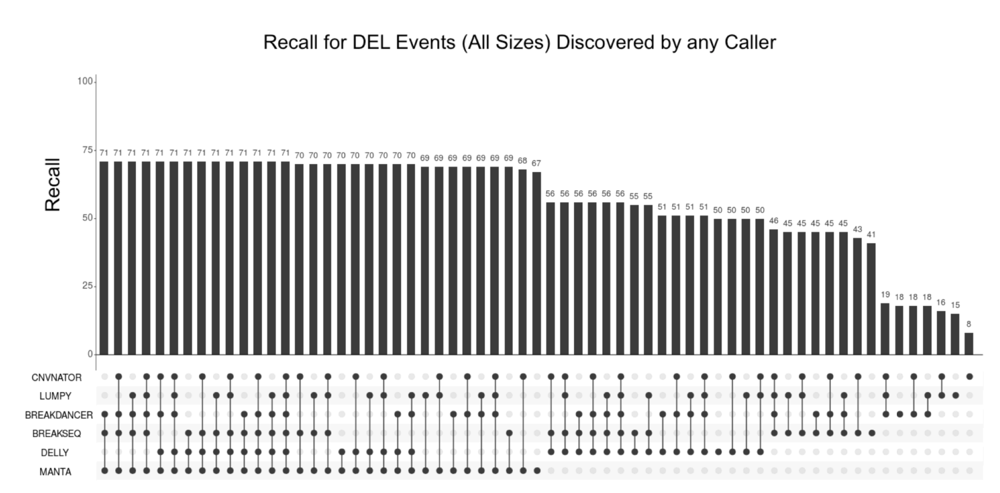

# Team Thrive: Combining Genotype and Medical Record Information

## Approach
Our goal was to combine genotype and phenotype information by combining variant calls with medical record data. We extracted medical keywords from all of the patient records and used the words to filter out the called genetic variants. We used the resulting set of variants from Qiagen Variant analysis as a starting point for further downstream analysis.

## Future direction

* Exploration of Structural variant
  * Consensus approach for variant calling
        https://www.biorxiv.org/content/biorxiv/early/2018/09/23/424267.full.pdf
        
  * Large structural variant discovery using de novo genome assembly
    * ONT assembly using WTDBG2
      * Assembled size = 2.8 Gbp
      * N50 contig = 6 Mbp
      * NG50 contig = 5.5 Mbp
